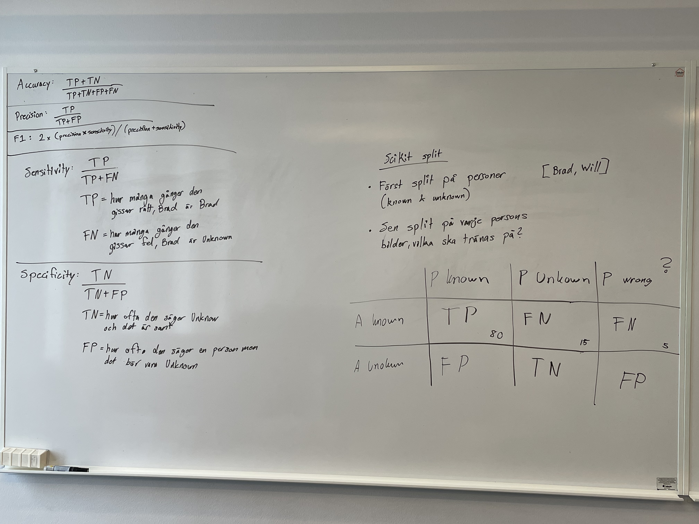
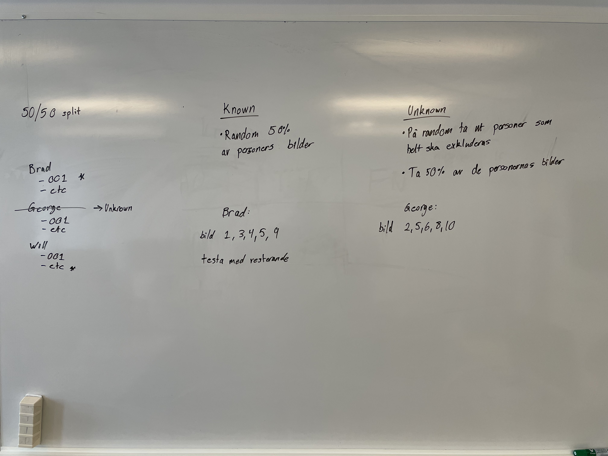

# 2026-02-23

We are discussing the methodology of our thesis. How should we preprocess the datasets?

## Training split

We will use a 50/50 split for both the groups and the image selection. SciKit will be used for doing the splitting.

### Known vs Unknown

We will split the dataset people into two groups, a group that is **Known** to select images from to train on, and a group that is **Unknown** that should have none of their images trained on, only tested.

### Training image selection

Of the **Known** group, select random 50% of their images to train the models on, the remaining 50% should be used for testing.

## Confusion Matrix

|                    | Predicted Known | Predicted Unknown | Predicted Wrong |
| ------------------ | --------------- | ----------------- | --------------- |
| **Actual Known**   | TP              | FN                | FN              |
| **Actual Unknown** | FP              | TN                |                 |

- **TP** - _True Positive_ is when the model correctly predicts the right person.
- **FN** - _False Negative_ is when the model predicts wrong, either unknown when the person actually exists, or the wrong person.
- **FP** - _False Positive_ is when the model predicts a person but the actual person doesn't exist.
- **TN** - _True Negative_ is when the model predicts correctly that the person doesn't exist.

The _Predicted Wrong_ category of the confusion matrix is only for seeing when the model predicts the wrong person (not unknown). So when the person exists in the training part of the dataset the result could be either correct prediction, predicted unknown when the person actually exists, or predicted the wrong person (like George when it was actually Brad).

 

## Images from discussion

